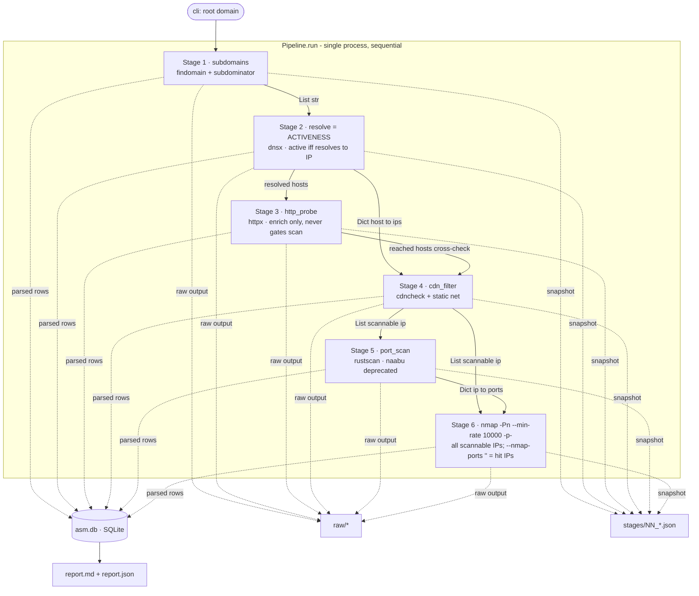

# NewASM — Architecture

**NewASM** is a staged external **Attack Surface Management (ASM)** recon pipeline.
Given one authorized root domain it enumerates subdomains, resolves them, probes
HTTP, filters CDN/WAF edges, port-scans the real origins, and deep-scans the open
ports — persisting every stage to SQLite + JSON for querying, diffing, and reporting.

- **Version:** 0.1.0
- **Runtime:** Python 3 (developed cross-platform via `pathlib`; runs on Kali Linux where the external tools live)
- **Entrypoint:** `python3 asm.py -d <domain> [options]`
- **Scope:** authorized VAPT / red-team recon on in-scope assets only

> **Design mandate:** this tool is deployed at organization level, so **scan
> correctness (zero false-negatives / false-positives) outranks performance** in
> every design decision. Defaults favor completeness; speed is opt-in. The
> correctness safeguards this drove are called out throughout and summarized in
> [§8](#8-correctness-safeguards).

---

## 1. Module layout

```
asm.py ..................... CLI entrypoint: argparse -> config.Settings -> Pipeline.run()
architecture.md ............ this document (system as-built)
archi_update.md ............ working notes: optimization roadmap + tracked defects/fixes
asmtool/
├─ __init__.py ............. package metadata (__version__)
├─ pipeline.py ............. orchestrator: run dir, run lifecycle, stage wiring, reporting
├─ stages.py .............. the 6 recon stages + Context + inter-stage input logging
├─ runner.py .............. CommandRunner: subprocess exec, tool discovery, timeouts
├─ storage.py ............. SQLite persistence (asm.db) + report readback
├─ config.py .............. Settings dataclass, tool binary names, timeouts
└─ utils.py ............... pure helpers: scope, IP validation, JSONL, static CDN net
```

**Layering (dependency direction):**

```
asm.py
  └─> pipeline.py ──> stages.py ──> runner.py   (external tools)
                          │     └──> storage.py  (SQLite)
                          └────────> utils.py    (pure functions)
                          └────────> config.py   (Settings / constants)
```

`stages.py` is the only place that knows *what* each recon step does; `runner.py`
and `storage.py` are side-effect adapters; `utils.py` is pure and independently
testable. The `Context` dataclass is the dependency-injection seam handing every
stage its `runner`, `storage`, `settings`, `domain`, `run_id`, and `workdir`.

---

## 2. End-to-end data flow



**Key properties**

- **Sequential, single process, in-memory hand-off.** Each stage returns a plain
  Python object consumed by the next. There is no message broker or async runtime
  (see [archi_update.md](archi_update.md) §2 for the planned asyncio model).
- **Triple persistence per stage:** verbatim tool output to `raw/`, a parsed
  snapshot to `stages/NN_*.json`, and normalized rows to `asm.db`. A crashed run
  therefore still leaves a queryable partial result.
- **Resilience:** `Pipeline.run()` wraps the whole chain in try/except so a
  `KeyboardInterrupt` (`status=interrupted`) or unexpected error (`status=error`)
  still finalizes the run row and writes a report.

---

## 3. The six stages

Each stage: reads its input, runs an external tool via `CommandRunner`, writes raw
output, persists parsed rows, and returns data for the next stage. All stages log
their received input via `_log_input()` (see [§9](#9-observability)).

### Stage 1 — Subdomain enumeration  `stage_subdomains`
- **Tools:** `findomain -t <domain> -q`; optionally `subdominator -d <domain> -o <file>`
  (RevoltSecurities; binary resolved from `--subdominator-bin`, PATH, or the known
  `~/Tools/Subdominator/sub/bin` location).
- **Input:** the seed root domain.
- **Logic:** collects names from findomain + subdominator + the seed, normalizes each
  (`utils.clean_host`), keeps only in-scope names (`utils.in_scope`), tracks
  provenance per name (which tool found it). subdominator writes one subdomain per
  line to `-o`; `in_scope` filtering drops any banner/log lines automatically.
  Both tools run non-interactively (empty stdin) and their failures are non-fatal.
- **Consolidation:** findomain ∪ subdominator (+ seed) are merged into one hostname-
  keyed dict, so overlaps collapse and only the **UNIQUE** in-scope set advances. The
  completion log reports the split (`findomain=X, subdominator=Y, overlap=Z`) and
  `01_subdomains.json` records per-source counts + a `by_source` map — the merge
  is auditable, not implicit.
- **Output:** `List[str]` of unique in-scope subdomains → `subdomains` table.
- **Toggle:** `--no-subdominator` (findomain only); `--subdominator-bin <path>`.

### Stage 2 — DNS resolution = ACTIVENESS  `stage_resolve`
- **Tool:** `dnsx -l <input> -a -aaaa -cname -resp -j -silent -o <out>` (+ `-wd <domain>` only if `--wildcard-filter`)
- **Input:** subdomains from Stage 1.
- **This is the activeness gate.** A subdomain is **active** iff dnsx returns at
  least one **A record**. Discovery (Stage 1, passive sources) does NOT imply a
  live IP — a discovered name can be NXDOMAIN, CNAME-to-dead-target, IPv6-only, or
  stale. Only active (resolving) names advance to CDN-filter / scanning.
- **Logic:** parses dnsx JSONL; stores `A` and `CNAME` records; maps subdomain→IP;
  marks a subdomain `resolves=1` when it has A records. **Drops only NXDOMAIN.**
  Logs the inactive names explicitly (discovered but unresolved → possible dangling
  DNS / subdomain-takeover candidates) so they're visible, not silently gone.
- **Output:** `Dict[host -> [ips]]` → `dns_records`, `subdomain_hosts` tables; the
  active/inactive split is surfaced in the report (see §7).
- **Correctness note:** `--wildcard-filter` (dnsx `-wd`) is **OFF by default** — on a
  CDN/wildcard-DNS domain it filters out every real subdomain. See
  [archi_update.md](archi_update.md) §3.
- **Known gap:** `-aaaa` is requested but only `a`/`cname` are parsed → IPv6 records
  are currently discarded (tracked, [archi_update.md](archi_update.md) §3.4).

### Stage 3 — HTTP probe  `stage_http_probe`  *(enrichment only)*
- **Tool:** `httpx-toolkit` (ProjectDiscovery httpx; binary `httpx-toolkit` preferred,
  else `httpx`), run with the flag set in `config.HTTPX_FLAGS`.
- **Input:** the active (resolving) hostnames — keys of Stage 2's map.
- **Logic:** enrichment only — records URL, status, title, webserver, **tech-detect**,
  plus the connected **IP**, **CNAME**, httpx's own **CDN** verdict, content
  type/length, redirect **location**, **favicon** mmh3 hash, **JARM** TLS
  fingerprint, **ASN**, and response time. **404s are stored, never dropped.**
  Never removes anything from the surface. Trim `config.HTTPX_FLAGS` if an older
  httpx build rejects a newer flag (favicon/jarm/asn).
- **Output:** `http_probes` table, **and returns the set of hosts httpx REACHED**
  (httpx emits a record only for hosts that answered = proof of a completed HTTP(S)
  handshake). This set feeds Stage 4's reachability cross-check.
- **Role:** httpx is **NOT** the activeness test — DNS resolution (Stage 2) is.
  A subdomain with no web server can still have open SSH/RDP/DB ports, so httpx
  must never *remove* a host from scanning; it only annotates and, via the
  cross-check, can force-KEEP a reachable host. It runs right after resolution
  (conventional recon order); the scan path does not otherwise depend on it.
- **Toggle:** `--no-httpx` (also disables the cross-check, since there's no data).

### Stage 4 — CDN / WAF filter  `stage_cdn_filter`
- **Tools:** `cdncheck -update` (refresh ranges), then `cdncheck -j -resp -silent`
  with the IP list piped on **STDIN** (JSON read from stdout). cdncheck's input flag
  is `-i`/stdin — **not** `-l`; passing `-l` made it exit rc=2 and classify nothing.
- **Input:** Stage 2's host→IP map (flattened + de-duplicated to unique public IPs).
- **Logic:** classifies each IP and decides what is *scannable* **by PROVIDER, not
  by cdncheck's category** — because cdncheck tags cloud load-balancer ranges
  (notably Google Cloud HTTPS LB) as category `cdn`/`waf` even though the IP is the
  org's own edge serving their apps. Skipping those is a false negative, so:
  - **`CDN_EDGE_PROVIDERS`** (Cloudflare, CloudFront, Fastly, Akamai, Imperva…) →
    genuine shared edges → **skipped** (scanning them yields the CDN's ports, not
    the client's, plus ban risk).
  - **`CLOUD_ORIGIN_PROVIDERS`** (Google, AWS, Azure, Oracle…) → the customer's own
    load balancer / instance → **kept scannable** unless `--no-cloud`. This is what
    fixes Google-LB-hosted services (grafana/jenkins) being wrongly dropped.
  - **Anything else cdncheck flags → fail OPEN and scan it** (never drop a possibly
    live origin), logging a warning so `CDN_EDGE_PROVIDERS` can be tuned.
  - **httpx-reachability cross-check:** any IP that Stage 3 proved reachable is
    force-kept scannable, overriding a cdncheck skip (empirical proof beats
    classification). Only ever *adds* hosts, so it can't cause a false negative.
    Genuine CDN edges stay skipped unless `--scan-reachable-cdn` (scanning an edge
    returns the edge's ports, not the origin's = false positive). Disable with
    `--no-httpx-rescue`.
  - Parsing is **schema-drift tolerant** (`_classify_cdncheck`): handles boolean
    flags, string values, nested objects, and name-only fields.
  - A **deterministic static safety net** (`utils.static_cdn_name`, Cloudflare +
    Fastly + Akamai published ranges) catches edges cdncheck missed (stale data /
    schema drift / tool absent) and **only ever adds** detections. Google/AWS are
    deliberately excluded from the static net because those ranges overlap real
    origins and blanket-flagging would drop live assets.
- **Output:** `List[str]` of scannable IPs → `hosts` table (`is_cdn`, `cdn_name`, `is_scannable`).
  Stage-4 stage artifacts (each IP tagged with the subdomain(s) that resolved to it):
  - `stages/04_hosts.json` — the **full host inventory**: every unique IP as
    `{ip, scannable, provider, category, source, subdomains}` — scannable AND
    CDN/WAF-skipped, so the whole surface is in one file.
  - `stages/04_all_domains.txt` — every resolved subdomain in the IP set, one per line.
  - `stages/04_scannable_domains.txt` — just the subdomains behind scannable (non-CDN)
    IPs, one per line (ready-to-use target list).
  - `stages/04_cdn_skipped.json` — the filtered-out CDN/WAF/cloud edges, each tagged
    with provider, category, which classifier caught it (`cdncheck` vs `static-net`),
    and its resolving subdomains — so the exclusion set is auditable.
- **Toggles:** `--no-cdncheck` (static net becomes sole classifier — weaker, test
  use), `--no-cdncheck-update`, `--no-cloud`, `--allow-private-ips`.

### Stage 5 — Port scan  `stage_port_scan`
- **Tool (default):** `rustscan -a <ip> --ulimit <n> -b <batch> -t <ms> --tries <n> -g --scan-order random`
  (per IP, threaded). `-b`/`-t`/`--tries` are **reliability tuning** (default batch
  1000, timeout 2500 ms, tries 2): on filtered / high-latency hosts an aggressive
  single-try burst loses open-port SYN-ACKs, so retransmits + a wider timeout +
  smaller batches materially cut false negatives.
- **Deprecated (opt-in):** `naabu -l <input> -s c -Pn -p - -rate <n> -c <n> -json -silent -o <out>`.
  naabu gave unreliable results in the field and was dropped from the default; the
  code path is retained (`--port-scanners "rustscan,naabu"`) until a replacement is chosen.
- **Input:** scannable IPs from Stage 4.
- **Logic:** runs **every scanner in `port_scanners`** and **UNIONs** the open ports.
  With the default single scanner there is no union; add a second scanner to restore
  the cross-check. **Skipped entirely under `--nmap-only`** (empty scanner list) — nmap
  then does its own full discovery. Persistence is single-threaded after the union.
- **Output:** `Dict[ip -> [ports]]` → `ports` table. **These ports are what Stage 6
  deep-scans in discovered-ports mode.**
- **Config:** `--port-scanners rustscan`, `--threads-portscan`, `--rustscan-ulimit`,
  `--rustscan-tries`, `--rustscan-timeout`, `--rustscan-batch` (`--naabu-rate` only
  if naabu is opted back in).
- **Caveat:** rustscan is unprivileged (connect-based) and stays a *fast signal*, not
  the authority — even tuned it can miss on aggressively-filtered hosts, which is why
  the default nmap still `-p-`s every scannable IP and `--nmap-only` exists.

### Stage 6 — nmap scan  `stage_nmap`
- **Tool:** `nmap -Pn --min-rate 10000 -p- -oX <xml> <ip>` (per IP, threaded).
- **Input:** the scannable IP list **and** Stage 5's port map.
- **Logic:** two scoping modes.
  - **ALL-SCANNABLE (default, `nmap_ports=["-p-"]`)** — nmap scans **every scannable
    IP** over the full port range, independent of the port scanner, so a lossy
    rustscan can't gate it (zero-FN at the port level). `--min-rate 10000` keeps the
    full sweep fast; the default flags do **not** run version/NSE (add `-sV`/`-A`).
  - **DISCOVERED (`--nmap-ports ""`)** — nmap scans only the ports Stage 5 found, on
    the hit IPs only (the fast, rustscan-dependent mode; skips portless IPs).
  `-Pn` avoids the "host down → skip" false negative on ICMP-silent hosts. Parses nmap
  XML for open ports (+ service/version and NSE findings **if** `-sV`/`-A`/`-sC` added).
- **Output:** enriches `ports`; populates `nmap_findings` (only when NSE is enabled).
- **Toggles:** `--no-nmap`, `--nmap-flags`, `--nmap-ports` (`""` = discovered mode),
  `--nmap-full` (force `-p-` on all), `--nmap-host-timeout`, `--nmap-only-rustscan-hits`.
- **Trade-offs:** the default drops version/NSE detection for speed (add `-sV` to
  restore); a high `--min-rate` can miss ports on lossy links — rustscan's Stage-5
  results are unioned into `ports` as a cross-check.

---

## 4. Persistence (`asm.db`, SQLite)

One portable single-file DB is the queryable "pipe" between stages. Raw tool output
stays on disk under `raw/`; only *parsed* rows go to SQLite. `UNIQUE` constraints
make re-runs idempotent. `run_id` scopes every row so multiple runs coexist.

| Table             | Written by                | Purpose |
|-------------------|---------------------------|---------|
| `runs`            | pipeline lifecycle        | one row per invocation: domain, started/finished, status |
| `subdomains`      | Stage 1 (Stage 2 flips `resolves`) | name, source (provenance), resolves 0/1 · `UNIQUE(run_id,name)` |
| `dns_records`     | Stage 2                   | A + CNAME rows · `UNIQUE(run_id,subdomain,type,value)` |
| `subdomain_hosts` | Stage 2                   | subdomain ↔ IP map · `UNIQUE(run_id,subdomain,ip)` |
| `hosts`           | Stage 4                   | unique IP, is_cdn, cdn_name, is_scannable · `UNIQUE(run_id,ip)` |
| `http_probes`     | Stage 3                   | url, status_code, title, webserver, tech, ip, cname, cdn_name, content_type/length, location, favicon, jarm, asn, response_time |
| `ports`           | Stage 5 (Stage 6 enriches)| ip, port, protocol, state, service, product, version · `UNIQUE(run_id,ip,port,protocol)` |
| `nmap_findings`   | Stage 6                   | ip, port, script_id, output, raw_ref |

**Concurrency safety:** the single SQLite connection is written **only from the main
thread**. Threaded stages (rustscan in Stage 5, nmap in Stage 6) return data via
`as_completed`, and the main thread performs the inserts — no cross-thread DB access.

---

## 5. Subprocess runner (`runner.py`)

Every external command goes through `CommandRunner` for uniform behavior:

- **Tool discovery:** `resolve_binary()` tries each candidate name (`shutil.which`,
  cached) — e.g. `httpx-toolkit` then `httpx`. `available()` gates each stage so a
  missing tool degrades gracefully instead of crashing mid-pipeline.
- **Execution:** `subprocess.run(capture_output=True, text=True, timeout=…)`.
  Returns `(returncode, stdout, stderr)`.
- **Conventions:** rc `127` = tool not found (never raises), rc `124` = timeout
  (like GNU `timeout`). The caller decides how to degrade.
- **Dry-run:** `--dry-run` logs the command and returns success without executing.

---

## 6. Configuration & CLI

All tunables live in `config.Settings`; CLI flags in `asm.py` override them per run.
Tool names/timeouts are module constants (`TOOL_BINARIES`, `TIMEOUTS`).

| Flag | Setting | Default | Effect |
|------|---------|---------|--------|
| `-d, --domain` | — | (required) | root domain to enumerate |
| `-o, --output` | — | `output` | output root directory |
| `--no-subdominator` | `use_subdominator` | on | Stage 1: findomain only |
| `--subdominator-bin` | `subdominator_bin` | PATH/known loc | path to subdominator binary |
| `--no-httpx` | `run_httpx` | on | skip Stage 3 |
| `--no-nmap` | `run_nmap` | on | skip Stage 6 |
| `--threads-portscan` | `threads_portscan` | 8 | rustscan worker fan-out |
| `--threads-nmap` | `threads_nmap` | 3 | nmap worker fan-out |
| `--port-scanners` | `port_scanners` | `rustscan` | scanners to run + UNION (naabu deprecated) |
| `--no-naabu` | (drops naabu) | off | **deprecated** — naabu no longer run by default |
| `--no-rustscan` | (drops rustscan) | off | skip the rustscan port scan |
| `--naabu-rate` | `naabu_rate` | 1000 | naabu packets/sec (only if naabu opted in) |
| `--rustscan-ulimit` | `rustscan_ulimit` | 5000 | rustscan `--ulimit` |
| `--rustscan-tries` | `rustscan_tries` | 2 | rustscan `--tries` (retransmits — cuts FNs on lossy hosts) |
| `--rustscan-timeout` | `rustscan_timeout` | 2500 | rustscan `-t` ms (raise for high-latency hosts) |
| `--rustscan-batch` | `rustscan_batch` | 1000 | rustscan `-b` batch (lower = less bursty = fewer drops) |
| `--nmap-flags` | `nmap_flags` | `-Pn --min-rate 10000` | nmap scan flags (add `-sV`/`-A` for version/NSE) |
| `--nmap-ports` | `nmap_ports` | `-p-` | scope for every scannable IP; `""` = discovered-ports mode |
| `--nmap-full` | `nmap_full` | off | zero-FN: nmap `-p-` on every scannable IP (slow) |
| `--nmap-only` | (skips Stage 5 + forces `-p-`) | off | nmap does ALL discovery; rustscan skipped (most reliable, slowest) |
| `--nmap-host-timeout` | `nmap_host_timeout` | (none) | nmap `--host-timeout` per IP (e.g. `20m`) — caps a stuck host |
| `--nmap-only-rustscan-hits` | `nmap_scan_all_scannable` | off (scan all) | with explicit scope, gate nmap on Stage-5 hits |
| `--threads-nmap` | `threads_nmap` | 3 | parallel nmap workers (raise once discovered-mode makes each host cheap) |
| `--no-cdncheck` | `use_cdncheck` | on | skip cdncheck; static net only |
| `--no-cdncheck-update` | `cdncheck_update` | on (update) | skip `cdncheck -update` |
| `--no-httpx-rescue` | `httpx_rescue` | on | disable the httpx-reachability cross-check |
| `--scan-reachable-cdn` | `scan_reachable_cdn` | off | rescue also force-scans reachable CDN edges |
| `--wildcard-filter` | `wildcard_filter` | off | dnsx `-wd` (brute-force only) |
| `--allow-private-ips` | `allow_private_ips` | off | also scan RFC1918/loopback |
| `--no-cloud` | `scan_cloud_ips` | on (keep cloud) | also skip cloud IPs |
| `--dry-run` | `dry_run` | off | log commands, don't execute |
| `-v, --verbose` | — | off | DEBUG logging (full stage payloads) |

---

## 7. Output artifacts

Each run creates `output/<domain>_<YYYYmmdd_HHMMSS>/`:

```
<domain>_<stamp>/
├─ asm.db ................. SQLite DB (all parsed rows)
├─ asm.log ............... full run log
├─ report.md ............. human-readable surface summary + open ports
├─ report.json ........... machine-readable counts + open ports
├─ raw/ .................. verbatim tool output (audit trail)
│   ├─ findomain.txt, dnsx.jsonl, httpx.jsonl, cdncheck.jsonl
│   ├─ rustscan/<ip>.txt, nmap/<ip>.xml  (naabu.jsonl only if opted in)
│   └─ *_input.txt ........ exact inputs fed to each tool
└─ stages/ ............... per-stage snapshots (01_..06_), incl.
                           04_hosts.json (ALL IPs + class + resolving subdomains),
                           04_all_domains.txt (every resolved subdomain),
                           04_scannable_domains.txt (live non-CDN target list),
                           04_cdn_skipped.json (filtered CDN/WAF edges + subdomains)
```

The report tables are built by re-reading `asm.db` (`Storage.counts()`,
`open_ports_summary()`, `active_subdomains()`, `inactive_subdomains()`), so the
report always reflects persisted truth. Both `report.md` and `report.json` include
a **Subdomains** section splitting **active** (resolved → scanned, with their IPs)
from **inactive** (discovered but unresolved → flagged for dangling-DNS review),
making the activeness decision auditable.

---

## 8. Correctness safeguards

The zero-FN / zero-FP mandate is enforced by these concrete measures:

| Risk | Safeguard |
|------|-----------|
| Wildcard filter nuking real subdomains | dnsx `-wd` **off by default** |
| CDN edges scanned as origins (FP) | cdncheck `-update` + schema-tolerant parser + static safety net |
| Real origins dropped as "CDN" (FN) | static net limited to pure-CDN providers; Google/AWS left to cdncheck; cloud kept by default |
| Lossy fast scanner hiding open ports (FN) | `--nmap-full` runs nmap `-p-` on **all** scannable IPs, ungated (opt-in; the default DISCOVERED mode trades this for speed — see §Stage 6 trade-off) |
| Single scanner missing ports (FN) | Stage 5 **UNIONs** all configured scanners (add a 2nd via `--port-scanners` — naabu deprecated, cross-check pending its replacement) |
| ICMP-silent hosts skipped (FN) | `-Pn` on nmap (and on naabu if opted in) |
| HTTP 404s dropped from surface | Stage 3 stores 404s, never drops |
| Silent tool failure | `CommandRunner` degrades gracefully; inter-stage logging shows empty hand-offs |

---

## 9. Observability

`stages._log_input()` logs every inter-stage hand-off so the data flow is visible:

- **INFO** (always): count + short sample —
  `→ stage5/port_scan input: 3 scannable IPs  (from stage4/cdn_filter)  [1.2.3.4, …]`
- **DEBUG** (`-v`): the full payload —
  `→ stage2/resolve input (full payload from stage1/subdomains): ['a.x.com', …]`

Hand-off chain: `cli → stage1/subdomains → stage2/resolve → {stage3/http_probe,
stage4/cdn_filter} → stage5/port_scan → stage6/nmap`. Each stage also emits a
`Stage N complete: …` summary. Logs go to stdout and `asm.log`.

---

## 10. External dependencies

Must be on `PATH` (Kali package names): `findomain`, `subdominator`, `dnsx`,
`httpx-toolkit`/`httpx`, `cdncheck`, `rustscan`, `nmap`. `naabu` is optional
(deprecated — only needed if opted back in via `--port-scanners`). Any missing tool
is skipped with a warning rather than aborting the run. Python stdlib only (no
third-party Python packages).

---

## 11. Known limitations & roadmap

Tracked in detail in [archi_update.md](archi_update.md):

- **IPv6 dropped** — Stage 2 ignores AAAA records (§3.4).
- **CDN-fronted origin discovery** — scanning edges alone under-reports the true
  surface; needs cert-transparency / historical-DNS / SPF-MX pivots (§3.3).
- **cdncheck data health** — observed emitting 0 records on obvious CDN IPs on some
  hosts; the static net backstops it, but verify with `cdncheck -i <ip> -json`.
- **Performance model** — current thread-per-subprocess fan-out has no global
  concurrency budget; planned move to asyncio + one semaphore + OS niceness/cgroups
  (§2, Tiers 1–3).
- **Discovery scanner** — naabu deprecated; single-scanner discovery (rustscan) now
  feeds DISCOVERED-mode nmap, so a scanner miss is unrecoverable without `--nmap-full`.
  Candidate replacement: a stateless sweep (masscan/zmap) to keep discovery both fast
  and complete, restoring the union cross-check (§3.1, §3.5).
- **`subdomains.source` accumulation** — provenance string appends on every touch
  (cosmetic) (§3.4).
```
